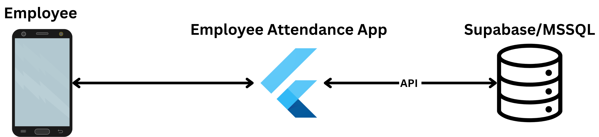

# employee_attendance App

## Introduction

Hello! This is a simple employee attendance mobile app that records and tracks employee time-in and time-out and their respective locations(longitude, latitude).

### Flutter Packages used:
- **geolocator**
    - record time in and time out locations
- **crypto**
    - password encryption
- **material**
    - provides Material Design UI components
- **shared_preferences**
    - stores local user session information
- **http**
    - sends HTTP requests to the Node.js API
- **connectivity_plus**
    - detects changes in internet connectivity
- **path**
    - access and manage local file paths for the SQLite database
- **sqflite**
    - create and manage the local SQLite database for offline attendance data

### Database Used:
- **MSSQL**(main DB)

## App Structure


## Instructions

### For **development** 
Make sure to input this in the terminal to download the necessary dependencies/packages
```
flutter pub get
```
After downloading the dependencies/packages you may input this in the terminal
```
flutter run
```
Or press ```F5``` to enter debug mode in VSCode.

**Note:** make sure you have an android emulator ready(I'm currently using pixel 8 Android 16 Balklava).

### Building the App

Before being able to get the app, you must build it using
```
flutter build apk --release
```

The latest .apk build is stored in ```/build/app/outputs/flutter-apk/app-release.apk```

Okay, I think that's all there is to it. Hope it helps! - *John Lorenz Codilla*


<!-- ## Getting Started

This project is a starting point for a Flutter application.

A few resources to get you started if this is your first Flutter project:

- [Learn Flutter](https://docs.flutter.dev/get-started/learn-flutter)
- [Write your first Flutter app](https://docs.flutter.dev/get-started/codelab)
- [Flutter learning resources](https://docs.flutter.dev/reference/learning-resources)

For help getting started with Flutter development, view the
[online documentation](https://docs.flutter.dev/), which offers tutorials,
samples, guidance on mobile development, and a full API reference. -->
